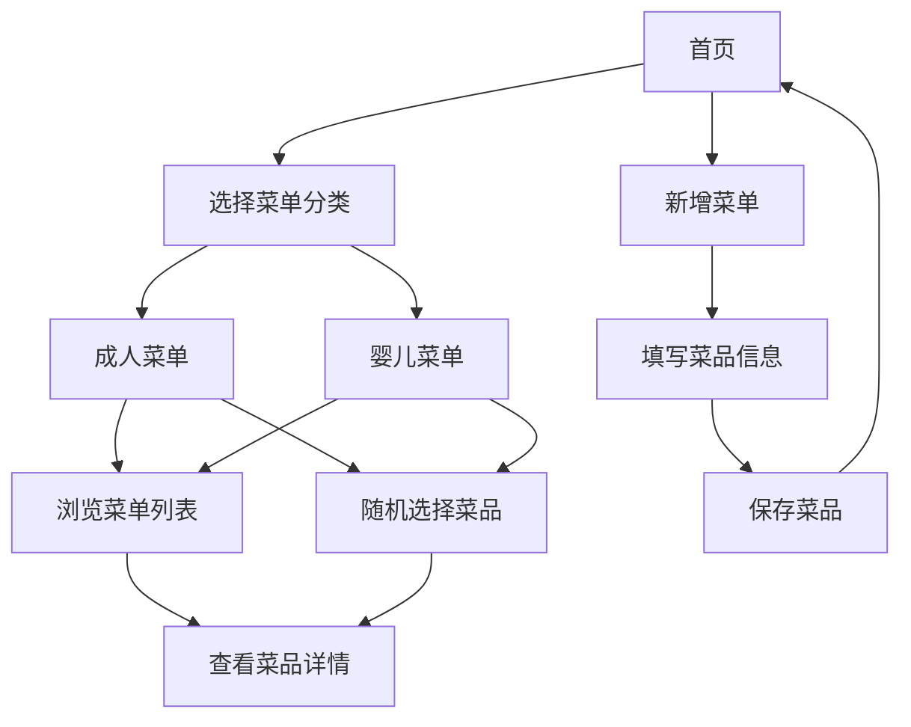

## 1. Product Overview
菜单随机选择器是一款帮助用户快速决定日常饮食的工具，支持成人和婴儿菜单分类。
- 解决用户每天纠结吃什么的问题，提供随机选择功能和丰富的菜谱库
- 目标用户为家庭主妇/主夫、烹饪爱好者，以及需要为婴儿准备食物的家长

## 2. Core Features

### 2.1 User Roles
| Role | Registration Method | Core Permissions |
|------|---------------------|------------------|
| Normal User | 无需注册 | 使用所有基础功能，包括查看菜单、随机选择、新增菜单 |

### 2.2 Feature Module
1. **首页**：菜单分类选择、随机选择功能、菜单列表展示
2. **菜单详情页**：菜品详情、制作步骤、营养信息
3. **新增菜单页**：添加新菜品、选择分类、填写详情

### 2.3 Page Details
| Page Name | Module Name | Feature description |
|-----------|-------------|---------------------|
| 首页 | 菜单分类选择 | 提供成人菜单和婴儿菜单两个分类选项，用户可切换查看 |
| 首页 | 随机选择功能 | 点击按钮随机生成一道菜品，支持按分类随机 |
| 首页 | 菜单列表 | 展示当前分类下的所有菜品，支持搜索和筛选 |
| 菜单详情页 | 菜品详情 | 显示菜品名称、图片、食材、制作时间等基本信息 |
| 菜单详情页 | 制作步骤 | 详细的制作步骤说明，包括图片和文字描述 |
| 菜单详情页 | 营养信息 | 显示菜品的营养成分，特别是婴儿菜单的营养分析 |
| 新增菜单页 | 添加新菜品 | 填写菜品名称、分类、食材、制作步骤等信息 |
| 新增菜单页 | 图片上传 | 支持上传菜品图片，或使用默认图片 |

## 3. Core Process
用户使用流程：
1. 用户打开应用，默认显示成人菜单分类
2. 用户可以浏览菜单列表，或点击随机按钮获取推荐
3. 用户点击感兴趣的菜品，进入详情页查看详细信息
4. 用户可以通过新增菜单功能添加自己的菜品
5. 用户可以在成人菜单和婴儿菜单之间切换

## 4. User Interface Design
### 4.1 Design Style
- 主色调：温暖的橙色 (#FF9F43) 和清新的绿色 (#1DD1A1)
- 次要色：白色 (#FFFFFF) 和浅灰色 (#F5F6FA)
- 按钮风格：圆角按钮，有轻微的阴影效果
- 字体：无衬线字体，主标题 20px，副标题 16px，正文 14px
- 布局风格：卡片式布局，清晰的视觉层次
- 图标风格：简约线条图标，搭配食物相关的emoji

### 4.2 Page Design Overview
| Page Name | Module Name | UI Elements |
|-----------|-------------|-------------|
| 首页 | 菜单分类选择 | 顶部Tab切换，成人菜单和婴儿菜单，选中状态有下划线和颜色变化 |
| 首页 | 随机选择功能 | 中央大型按钮，点击时有动画效果，按钮上有骰子图标 |
| 首页 | 菜单列表 | 卡片式布局，每个卡片包含菜品图片、名称和简短描述 |
| 菜单详情页 | 菜品详情 | 顶部大图，下方文字信息，使用卡片布局 |
| 菜单详情页 | 制作步骤 | 步骤编号+文字描述，每个步骤之间有分隔线 |
| 菜单详情页 | 营养信息 | 图表展示营养成分，使用绿色系配色 |
| 新增菜单页 | 添加新菜品 | 表单布局，输入框有占位符，提交按钮醒目 |
| 新增菜单页 | 图片上传 | 上传区域有虚线边框，支持拖拽上传 |

### 4.3 Responsiveness
- 设计采用移动优先原则，确保在安卓端和web端都有良好的显示效果
- 针对不同屏幕尺寸进行自适应调整
- 触摸优化：按钮和可点击区域足够大，适合手指操作

### 4.4 3D Scene Guidance
- 无3D场景需求